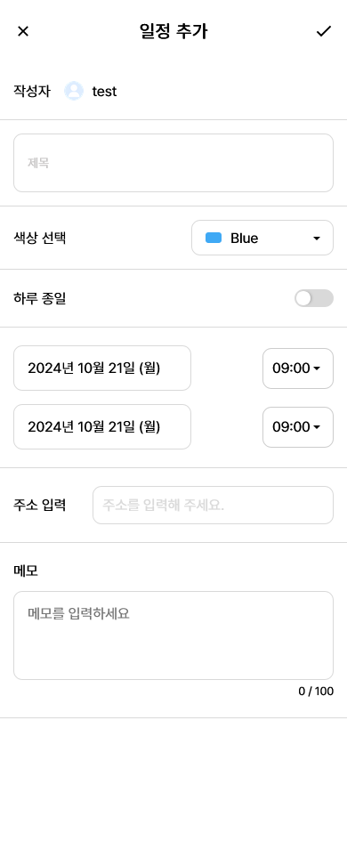

# 📅 스케쥴러, To-Do Site TimeFlow


<a href="https://time-flow-app.vercel.app">

</a>

- 배포 URL : https://time-flow-app.vercel.app
    - 테스트 이메일 : test@test.com
    - 테스트 비밀번호 : qqq111!!!

- [](https://github.com/gustn1029/team-scheduler) 
- [](https://www.figma.com/design/dLjpvzCFiJu486ymphJFtm/Team_Scheduler?node-id=171-707&node-type=frame&t=jMkuuEiFHgB5wWWU-0) 
- [](https://www.notion.so/10631d91ebd780f796eac9bfcf443400?pvs=4)

<br>

## 프로젝트 소개

### 효율적인 일정 및 작업 관리를 위한 올인원 솔루션 TimeFlow

일상 생활과 업무의 균형을 유지하는 것이 점점 더 어려워지는 현대 사회에서, 효과적인 시간 관리는 성공의 핵심 요소입니다. 이러한 필요성을 충족시키기 위해 개발된 이 웹 애플리케이션은 캘린더와 To-Do 리스트를 완벽하게 통합하여 사용자의 생산성을 극대화합니다.

#### 주요 기능

- **직관적인 캘린더 인터페이스**: 월별, 주별, 일별 보기로 일정을 한눈에 파악할 수 있습니다.
- **유연한 To-Do 리스트**: 우선순위 설정, 마감일 지정, 반복 작업 설정 등 다양한 옵션을 제공합니다.
- **캘린더와 To-Do의 완벽한 연동**: To-Do 항목을 캘린더에 쉽게 추가하고 관리할 수 있습니다.
- **알림 기능**: 중요한 일정과 작업을 놓치지 않도록 맞춤형 알림을 설정할 수 있습니다.
- **다양한 기기 지원**: 반응형 디자인으로 데스크톱, 태블릿, 모바일 등 모든 기기에서 원활하게 사용 가능합니다.

이 웹페이지는 개인 사용자부터 소규모 팀까지 다양한 사용자의 요구를 충족시킬 수 있도록 설계되었습니다. 직관적인 사용자 인터페이스와 강력한 기능을 통해 사용자는 더 효율적으로 시간을 관리하고 목표를 달성할 수 있습니다.

> 시간은 한정되어 있지만, 이 도구를 활용하면 그 시간을 최대한 활용할 수 있습니다. 지금 바로 시작하여 당신의 일상을 더욱 체계적이고 생산적으로 만들어보세요.

<br>

## 팀원 구성

<div align="center">

| **김현수** | **이한수** | **이민서** | **신진석** |
|:-------:|:-------:|:-------:|:-------:|
| [](https://github.com/gustn1029) | [](https://github.com/biktory01) | [](https://github.com/LeeMinseo0117) |  [](https://github.com/nanamihiromachi) |

</div>

<br>

## 1. 개발 환경

- 디자인 : 
    - 
- 버전 및 이슈관리 : 
    - 
- 협업 툴 : 
    - 
    - 
- 서비스 배포 환경 : 
    - 

- 개발 도구 :
    - 

- Front-end : 
    - 
    - 

 - Back-end :   
    - 
<br>

## 2. 채택한 개발 기술과 브랜치 전략

### 

- **React**를 채택한 이유

    - 컴포넌트 기반 아키텍처로 재사용성과 유지보수성이 높습니다.

        - Virtual DOM을 통해 효율적인 렌더링 성능을 제공합니다.
        - 풍부한 생태계와 커뮤니티 지원으로 다양한 라이브러리와 도구를 활용할 수 있습니다.

- 전체 프로젝트의 UI 구조를 React 컴포넌트로 구성하여 효율적인 개발 환경을 구축했습니다.

### 

- **TypeScript**를 채택한 이유

    - 강력한 타입 시스템으로 런타임 오류를 줄이고 코드의 안정성을 높입니다.
    - 자동 완성, 리팩토링 등 개발 도구의 지원을 강화하여 생산성을 향상시킵니다.
    - 코드의 가독성과 자체 문서화 효과로 팀 협업과 유지보수가 용이해집니다.

- 모든 React 컴포넌트와 주요 함수에 타입을 적용하여 버그를 사전에 방지하고 코드 품질을 개선했습니다.

### 

- **Sass**를 채택한 이유

    - 변수, 중첩 규칙, 믹스인 등의 기능으로 CSS 코드의 재사용성과 가독성을 높입니다.
    - 대규모 스타일시트를 더 구조화되고 관리하기 쉽게 만들 수 있습니다.
    - CSS와 완전히 호환되어 기존 CSS 지식을 활용하면서 점진적으로 도입할 수 있습니다.


- 컴포넌트별 스타일 모듈화와 전역 스타일 관리에 활용하여 스타일 충돌을 방지하고 유지보수성을 개선했습니다.

### 

- Lorem Ipsum is simply dummy text of the printing and typesetting industry. 

### 

- **TanStack Query**를 채택한 이유

    - 서버 데이터 캐싱, 동기화, 업데이트를 효율적으로 관리할 수 있습니다.
    - 비동기 데이터 요청 관리를 단순화하고 코드의 가독성을 높입니다.
    - 내장된 devtools로 데이터 흐름을 쉽게 디버깅할 수 있습니다.

- API 요청 결과를 캐싱하여 불필요한 네트워크 요청을 줄이고, 데이터 갱신 시 자동으로 리렌더링되는 기능을 활용했습니다.

### 

- **React Hook Form**을 채택한 이유

    - 불필요한 리렌더링을 줄여 폼 성능을 최적화합니다.
    - 직관적인 API로 복잡한 폼 로직을 쉽게 구현할 수 있습니다.
    - 기본적인 폼 검증 기능을 내장하고 있어 별도의 설정 없이 사용 가능합니다.

- 회원가입, 로그인 등 다양한 폼에서 사용하여 코드의 일관성과 유지보수성을 높였습니다.

### 

- **Zustand**를 채택한 이유

    - 최소한의 보일러플레이트로 빠르게 상태 관리를 구현할 수 있습니다.
    - Redux와 달리 별도의 Provider 래핑이 필요 없어 사용이 간편합니다.
    - 작은 번들 사이즈로 애플리케이션의 성능에 미치는 영향이 적습니다.

- 전역 상태 관리가 필요한 날짜 정보, 모달 설정, To-Do 등에 활용하여 컴포넌트 간 상태 공유를 효율적으로 처리했습니다.

### 브랜치 전략

- **Git-flow** 전략을 기반으로 **main**, **dev** 브랜치와 **feature**, 버그 수정을 위한 **fix** 보조 브랜치를 운용했습니다.
    - **main** 브랜치는 배포 단계에서만 사용하는 브랜치입니다.
    - **dev** 브랜치는 개발 단계에서 git-flow의 master 역할을 하는 브랜치입니다.
    - **feature** 브랜치는 기능 단위로 독립적인 개발 환경을 위하여 사용했습니다.
    - **fix** 브랜치는 수정이 필요한 기능 단위로 독립적인 개발 환경을 위하여 사용했습니다.


<br>

## 3. URL 구조(모놀리식)

- accounts

| App       | URL                                        | Views Function    | HTML File Name                        | Note           |
|-----------|--------------------------------------------|-------------------|---------------------------------------|----------------|
| accounts  | 'login/'                                   | login             | src/          components/pages/login         |로그인           |
| accounts  | 'signup/'                                | signup          | src/          components/pages/signup                |회원가입         |
| accounts  | 'profile/'                                 | profile           | src/          components/profile                 | 프로필 상세 및 수정 |
| accounts  | 'findpassword/'                                 | findpassword           | src/          components/pages/findpassword                 | 비밀번호 찾기 기능 |

- calendar

| App       | URL                                        | Views Function    | HTML File Name                        | Note           |
|-----------|--------------------------------------------|-------------------|---------------------------------------|----------------|
| calendar      | '/calendar'                                        | calendar              | src/components/pages/calendar                        | 캘린더 메인 화면          |
| calendar      | '/create'                                  | create             | src/components/pages/create                       | 캘린더 생성               |
| calendar      | '/calendarlist'                                  | calendarlist             | src/components/pages/calendarlist                       | 캘린더 편집
| calendar      | '/calendarList'                                  | detail             | src/components/pages/detail                       | 캘린더 상세
| calendar      | '/todo'                                  | todo             | src/components/pages/todos                       | To-Do 생성 및 편집, 삭제 |
| calendar      | '/notFound'                                  |   notFound           | src/components/pages/notFound                       | 404 페이지 |

## 4. 프로젝트 구조

```
📦src
 ┣ 📂assets
 ┃ ┣ 📂images
 ┃ ┃ ┣ 📂calendar
 ┃ ┃ ┃ ┗ 📜nav_arrow_btn.png
 ┃ ┃ ┣ 📂create
 ┃ ┃ ┃ ┗ 📜profileImg.png
 ┃ ┃ ┣ 📂profile
 ┃ ┃ ┃ ┣ 📜profile.png
 ┃ ┃ ┃ ┣ 📜profile.svg
 ┃ ┃ ┃ ┗ 📜thumbnail.svg
 ┃ ┃ ┣ 📂utils
 ┃ ┃ ┃ ┣ 📜check1-checked.svg
 ┃ ┃ ┃ ┣ 📜check1.svg
 ┃ ┃ ┃ ┗ 📜not_found.png
 ┃ ┃ ┣ 📜googleLogo.svg
 ┃ ┃ ┣ 📜logo.svg
 ┃ ┃ ┣ 📜logout.svg
 ┃ ┃ ┗ 📜preparing.png
 ┃ ┗ 📜react.svg
 ┣ 📂components
 ┃ ┣ 📂button
 ┃ ┃ ┣ 📂iconButton
 ┃ ┃ ┃ ┣ 📜IconButton.tsx
 ┃ ┃ ┃ ┣ 📜IconLinkButton.tsx
 ┃ ┃ ┃ ┗ 📜iconButton.module.scss
 ┃ ┃ ┣ 📜Button.tsx
 ┃ ┃ ┣ 📜LinkButton.tsx
 ┃ ┃ ┗ 📜button.module.scss
 ┃ ┣ 📂createModal
 ┃ ┃ ┣ 📜CreateModal.tsx
 ┃ ┃ ┗ 📜createModal.module.scss
 ┃ ┣ 📂header
 ┃ ┃ ┣ 📜Header.tsx
 ┃ ┃ ┗ 📜header.module.scss
 ┃ ┣ 📂inputs
 ┃ ┃ ┣ 📂checkbox
 ┃ ┃ ┃ ┣ 📜LabelCheckbox.tsx
 ┃ ┃ ┃ ┣ 📜TodoCheckbox.tsx
 ┃ ┃ ┃ ┣ 📜labelCheckbox.module.scss
 ┃ ┃ ┃ ┗ 📜todoCheckbox.module.scss
 ┃ ┃ ┣ 📂input
 ┃ ┃ ┃ ┣ 📜LabelInput.tsx
 ┃ ┃ ┃ ┗ 📜labelInput.module.scss
 ┃ ┃ ┣ 📂radio
 ┃ ┃ ┃ ┣ 📜LabelRadio.tsx
 ┃ ┃ ┃ ┗ 📜labelRadio.module.scss
 ┃ ┃ ┣ 📂select
 ┃ ┃ ┃ ┣ 📜LabelSelect.tsx
 ┃ ┃ ┃ ┗ 📜labelSelect.module.scss
 ┃ ┃ ┣ 📂textarea
 ┃ ┃ ┃ ┣ 📜LabelTextarea.tsx
 ┃ ┃ ┃ ┗ 📜labelTextarea.module.scss
 ┃ ┃ ┣ 📂toggle
 ┃ ┃ ┃ ┣ 📜LabelToggle.tsx
 ┃ ┃ ┃ ┗ 📜labelToggle.module.scss
 ┃ ┃ ┣ 📜LabelLayout.tsx
 ┃ ┃ ┗ 📜labelLayout.module.scss
 ┃ ┣ 📂kakaoMap // 주소 불러오기를 위한 컴포넌트
 ┃ ┃ ┣ 📜KakaoMap.tsx
 ┃ ┃ ┗ 📜kakaoMap.module.scss
 ┃ ┣ 📂layouts
 ┃ ┃ ┣ 📜MainAnimationLayout.tsx
 ┃ ┃ ┗ 📜RouteLayout.tsx
 ┃ ┣ 📂loader
 ┃ ┃ ┣ 📜Loader.tsx
 ┃ ┃ ┗ 📜loader.module.scss
 ┃ ┣ 📂modal
 ┃ ┃ ┣ 📜Modal.tsx
 ┃ ┃ ┗ 📜modal.module.scss
 ┃ ┣ 📂navigation
 ┃ ┃ ┣ 📜Navigation.tsx
 ┃ ┃ ┗ 📜navigation.module.scss
 ┃ ┣ 📂pages
 ┃ ┃ ┣ 📂SignUp // 회원 가입 페이지
 ┃ ┃ ┃ ┣ 📜SignUp.tsx
 ┃ ┃ ┃ ┗ 📜signup.module.scss
 ┃ ┃ ┣ 📂calendar   // 캘린더 페이지
 ┃ ┃ ┃ ┣ 📜CalendarComponent.tsx
 ┃ ┃ ┃ ┗ 📜calendar.module.scss
 ┃ ┃ ┣ 📂calendarlist   // 캘린더 목록 페이지
 ┃ ┃ ┃ ┣ 📜CalendarList.tsx
 ┃ ┃ ┃ ┗ 📜calendarlist.module.scss
 ┃ ┃ ┣ 📂create // 캘린더 생성 페이지
 ┃ ┃ ┃ ┣ 📜Create.tsx
 ┃ ┃ ┃ ┣ 📜CustomTimePicker.tsx
 ┃ ┃ ┃ ┗ 📜create.module.scss
 ┃ ┃ ┣ 📂detail // 캘린더 상세 페이지
 ┃ ┃ ┃ ┣ 📜Detail.tsx
 ┃ ┃ ┃ ┗ 📜detail.module.scss
 ┃ ┃ ┣ 📂edit   // 캘린더 일정 수정 페이지
 ┃ ┃ ┃ ┗ 📜Edit.tsx
 ┃ ┃ ┣ 📂findpassword   // 비밀번호 찾기 페이지
 ┃ ┃ ┃ ┣ 📜FindPassword.tsx
 ┃ ┃ ┃ ┗ 📜findpassword.module.scss
 ┃ ┃ ┣ 📂login  // 로그인 페이지
 ┃ ┃ ┃ ┣ 📜Login.tsx
 ┃ ┃ ┃ ┗ 📜login.module.scss
 ┃ ┃ ┣ 📂notFound   // 404 페이지
 ┃ ┃ ┃ ┣ 📜NotFound.tsx
 ┃ ┃ ┃ ┗ 📜notFound.module.scss
 ┃ ┃ ┣ 📂todos  // To-do 페이지
 ┃ ┃ ┃ ┣ 📜TodoForm.tsx
 ┃ ┃ ┃ ┣ 📜TodoList.tsx
 ┃ ┃ ┃ ┣ 📜TodoListItem.tsx
 ┃ ┃ ┃ ┣ 📜Todos.tsx
 ┃ ┃ ┃ ┗ 📜todos.module.scss
 ┃ ┃ ┣ 📜Profile.module.scss
 ┃ ┃ ┗ 📜Profile.tsx    // 프로필 페이지
 ┃ ┣ 📂test
 ┃ ┃ ┣ 📜FormTest.tsx
 ┃ ┃ ┗ 📜formTest.module.scss
 ┃ ┣ 📂toast
 ┃ ┃ ┣ 📜ToastProvider.tsx
 ┃ ┃ ┗ 📜toast.module.scss
 ┃ ┗ 📂tootip
 ┃ ┃ ┣ 📜ErrorTooltip.tsx
 ┃ ┃ ┗ 📜errorTooltip.module.scss
 ┣ 📂firebase
 ┃ ┗ 📜config.ts
 ┣ 📂hooks
 ┃ ┣ 📜useAuthState.ts
 ┃ ┣ 📜useHolidayMutaionHook.ts
 ┃ ┗ 📜useKakaoLoader.ts
 ┣ 📂store
 ┃ ┣ 📜useDateStore.ts
 ┃ ┣ 📜useModalStore.ts
 ┃ ┣ 📜useTodoStore.ts
 ┃ ┗ 📜useViewNavStore.ts
 ┣ 📂types
 ┃ ┣ 📂enum
 ┃ ┃ ┣ 📜ButtonEnum.ts
 ┃ ┃ ┗ 📜EventTypeEnum.ts
 ┃ ┗ 📜index.ts
 ┣ 📂utils
 ┃ ┣ 📜Animations.ts
 ┃ ┣ 📜ErrorHandler.ts
 ┃ ┗ 📜http.ts
 ┣ 📜App.tsx
 ┣ 📜index.css
 ┣ 📜main.tsx
 ┗ 📜vite-env.d.ts
```

<br>

## 5. 역할 분담

### 김현수

- **UI**

    - 페이지 : 캘린더 메인, To-Do, 404
    - 공통 컴포넌트 : Menu, Button, Input, Modal

- **기능**

    - 캘린더 일정 출력, To-Do 출력, To-Do 등록, 수정, 삭제, 회원 탈퇴, 애니메이션
<br>

### 이한수

- **UI**

    - 페이지 : 일정 추가, 일정 편집
    - 공통 컴포넌트 : Header

- **기능**

    - 일정 추가, 일정 편집, 메모 글자 수 제한, 뒤로 가기 버튼, 등록 버튼

<br>

### 이민서

- **UI**

    - 회원가입, 로그인, 일정 목록, 일정 상세, 준비중

- **기능**

    - 회원가입, 로그인, 일정 목록, 일정 상세, 회원가입 유효성 및 중복성 검사, 로그인 유효성 및 중복성 검사

- **데이터베이스**

    - Firebase 초기 세팅 및 연결
<br>

### 신진석

- **UI**
    - 프로필 상세 및 편집 작업 및 README 작성
- **기능**
    - 프로필 상세 및 편집

<br>

## 6. 개발 기간 및 작업 관리

### 개발 기간

- 전체 개발 기간 : 2024-09-23 ~ 2024-10-20
- UI 구현 : 2024-09-25 ~ 2024-10-04
- 기능 구현 : 2024-10-04 ~ 2024-10-16
- 1차 테스트 및 오류 수정: 2024-10-17 ~ 2024-10-18
- 2차 테스트 및 오류 수정: 2024-10-18 ~ 2024-10-20

<br>

### 작업 관리
 
- 매일 오전에 전체 회의를 진행하며, 오늘의 목표 및 건의사항 등을 얘기하고, 오후에 전체 회의를 진행하며 진행 사항을 공유했습니다.
- 각각의 기능, 페이지에 맞게 브랜치를 생성하여 GitHub를 관리했습니다. 

<br>

## 7. 신경 쓴 부분

### react-hook-form 활용 최적화

react-hook-form을 도입하여 폼 관리를 크게 개선했습니다. 이 라이브러리의 핵심 기능을 최대한 활용하여 성능과 사용자 경험을 향상시켰습니다.


- 성능 최적화

    - 불필요한 리렌더링을 최소화하고 폼 제출 시 데이터 처리 속도를 개선했습니다. 이를 통해 대규모 폼에서도 부드러운 사용자 경험을 제공할 수 있게 되었습니다.

- 유효성 검사 강화

    - Yup이나 Zod와 같은 스키마 유효성 검사 라이브러리를 react-hook-form과 통합하여 강력하고 유연한 폼 유효성 검사 시스템을 구축했습니다. 이를 통해 사용자 입력 오류를 즉시 감지하고 피드백을 제공할 수 있게 되었습니다.

- 타입 안정성

    - TypeScript와 함께 react-hook-form을 사용하여 폼 데이터의 타입 안정성을 확보했습니다. 이로 인해 개발 과정에서 발생할 수 있는 오류를 사전에 방지하고 코드의 신뢰성을 높였습니다.

- 테스트 용이성

    - react-hook-form의 테스트 친화적인 API를 활용하여 단위 테스트와 통합 테스트를 작성했습니다. 이를 통해 폼 로직의 안정성을 보장하고 지속적인 유지보수를 용이하게 만들었습니다.

- 동적 폼 구현

    - react-hook-form의 `useFieldArray` 훅을 사용하여 동적으로 필드를 추가하거나 제거할 수 있는 복잡한 폼을 구현했습니다. 이를 통해 사용자의 다양한 요구사항을 유연하게 수용할 수 있게 되었습니다.

세밀한 에러 핸들링 로직을 구현하여 사용자에게 명확하고 친절한 오류 메시지를 제공했습니다. 이는 폼 작성 과정에서 사용자의 혼란을 최소화하고 성공적인 제출률을 높이는 데 기여했습니다.

이러한 노력을 통해 react-hook-form의 장점을 최대한 활용하고, 프로젝트의 요구사항에 맞는 최적의 폼 관리 솔루션을 구현할 수 있었습니다.


### React Testing Library 사용 시 주요 고려사항

- 사용자 관점 테스트

    - 사용자가 실제로 보고 상호작용하는 요소에 집중합니다. 내부 구현보다는 사용자 경험을 테스트합니다.

- 접근성 우선

    - getByRole, getByLabelText 같은 접근성 친화적인 쿼리를 우선 사용합니다.

- 비동기 처리

    - waitFor와 act를 사용해 비동기 작업과 상태 업데이트를 올바르게 테스트합니다.

- 테스트 격리

    - afterEach로 각 테스트 후 cleanup을 실행하여 테스트 간 독립성을 유지합니다.

- 효율적인 쿼리 선택

    - 상황에 맞는 적절한 쿼리 메서드를 선택합니다. findBy는 비동기 요소에, getBy는 즉시 나타나는 요소에 사용합니다.

<br>

## 8. 페이지별 기능

### 로그인

- 서비스 접속 초기 화면으로 로그인 화면이 나타납니다.
- Firebase에 유저가 저장되어 있을 경우 해당 이메일 및 구글 이메일로 로그인 가능합니다.
- Firebase에 유저가 저장되어 있지 않은 경우 이메일 로그인이 불가능 하고, 회원가입으로 유저 등록 후 이용 가능합니다.
- 구글 이메일이 있는 사용자는 회원가입 없이 구글 로그인만으로도 회원가입 및 로그인 가능합니다.
- 이메일 형식이 맞지 않을 경우, 이메일 로컬 부분이 30자 이상인 경우, 비밀번호가 8자 이내인 경우, 비밀번호에 영어 소문자, 특수문자, 숫자를 모두 포함하지 않은 경우, input의 값이 비어있는 경우,각 경우에 맞게 유효성 검사를 하고 경고 문구가 나타납니다.

| 로그인 |
|----------|
|  |

<br>

### 회원가입

- 이메일 형식이 맞지 않을 경우, 이메일 로컬 부분이 30자 이상인 경우, 비밀번호가 8자 이내인 경우, 비밀번호 확인 input이 비밀번호 input의 값과 일치하지 않은 경우, 비밀번호에 영어 소문자, 특수문자, 숫자를 모두 포함하지 않은 경우, input의 값이 비어있는 경우, 각 경우에 맞게 유효성 검사를 하고 경고 문구가 나타납니다.
- 이메일 중복시 회원가입이 불가능 합니다.
- input의 값을 전체 입력하면 확인 버튼 색상이 변경됩니다.
- 조건과 일치하지 않는 input일 경우, border의 색상이 빨간색으로 변경되고 경고 문구가 출력됩니다.
- 조건과 일치하는 input일 경우, border의 색상이 초록색으로 변경됩니다.
- 조건과 일치하지 않았다가 일치하게 작성했을 경우, border의 색상이 빨간색에서 초록색으로 변경되며 경고 문구가 사라집니다.
- input 값 입력 및 유효성 검사, 중복 검사를 모두 통과하면 Firebase에 정보 저장 및 회원가입이 완료됩니다.

| 회원가입 |
|----------|
|  |

<br>

### 캘린더 메인 페이지

- 햄버거 버튼을 클릭하여 메뉴를 확인할 수 있습니다.
- 로그인한 사용자가 등록한 이벤트와 공휴일이 캘린더에 표시됩니다.
- 로그인한 사용자가 등록한 투두가 있는지 확인할 수 있는 버튼이 출력됩니다.
- 상단의 < , > 버튼을 통해 캘린더에 표시되는 월을 변경할 수 있습니다.
- "+" 버튼을 통해 일정, 투두를 등록할 수 있습니다.
- 오늘 날짜 또는 선택한 날짜의 배경과 일자 부분의 디자인이 변경 되도록 구현하였습니다.
-  일정이 등록되지 않은 날짜를 클릭하면 일정, 투두를 등록할 수 있는 모달이 출력되고 등록된 일정을 클릭하면 일정 목록 페이지로 이동, 투두 버튼을 클릭하면 투두를 확인할 수 있는 페이지로 이동합니다.
- 일정의 기간에 따라 캘린더에 출력되는 순서가 변경되어 출력됩니다.
- 메뉴를 통해 로그아웃이 가능합니다.
- 메뉴를 통해 프로필 관리 페이지로 이동이 가능합니다.

| 캘린더 | 메뉴 |
|----------|----------|
|  |  |

<br>

### 일정 추가 페이지

- 캘린더 상단의 추가 버튼이나, 달력의 날짜를 클릭해 나오는 모달에서 이동 가능한 페이지입니다.
- 페이지 상단에 작성자의 닉네임과 프로필 이미지가 표시됩니다.
- 제목을 2글자 이상 입력하지 않으면 일정이 등록되지 않습니다.
- 자신이 원하는 색상을 선택할 수 있습니다.
- 하루 종일 토글을 활성화 하면 timePicker는 비활성화 됩니다.
- 앞에 있는 날짜보다 빠르거나 뒤에 있는 날짜보다 늦는 날짜를 적용했을 때에는 datePicker가 작동하지 않습니다.
- 메모를 100글자 까지만 입력할 수 있으며, 필수사항이 아닙니다.
- 일정이 추가되면 캘린더 페이지로 이동합니다.

| 일정 추가 | 하루 종일 설정 시 | 주소 추가 | 일정 추가 시연 |
|----------|----------|----------|----------|
|  |  |  |  |

<br>

### 일정 목록 페이지

- 공휴일, 작성한 일정을 날짜별로 확인할 수 있습니다.
- 공휴일은 일정 목록 최상단에 위치합니다.
- 하루종일로 설정한 일정은 목록에 "종일"로 나오며 시간을 설정한 일정은 시작 시간과 종료 시간이 나옵니다.
- 시작 날짜 < 종료 날짜일 경우에는 종료 시간은 00:00으로 나오게 됩니다.
- 시작 날짜 > 종료 날짜일 경우에는 시작 시간은 00:00으로 나오게 됩니다.
- 우측 상단의 + 클릭시 모달창이 나옵니다.

| 일정 목록 페이지 |
|----------|
|  |

<br>

### 일정 상세 페이지

- 우측 상단은 각각 일정 편집, 일정 삭제 버튼으로 이루어져 있습니다.
- 일정 편집 클릭 시 해당 일정의 id를 일정 편집 페이지에 보내줍니다.
- 일정 삭제 클릭 시 Firebase에서도 해당 일정 데이터를 제거합니다.
- 해당 일정의 작성자 닉네임, 작성자 프로필 이미지, 일정 색상, 일정 제목, 일정 시작 및 종료 시간, 메모를 보여줍니다.

| 일정 상세 페이지 |
|----------|
|  |

<br>

### 일정 수정 페이지

- 일정 상세 페이지의 상단에 편집 아이콘을 클릭하면 이동하는 페이지입니다.
- 페이지 상단에 작성자의 닉네임과 프로필 이미지가 표시됩니다.
- 제목을 2글자 이상 입력하지 않으면 일정이 등록되지 않습니다.
- 자신이 원하는 색상으로 변경 가능 합니다.
- 하루 종일 토글을 활성화 하면 timePicker는 비활성화 됩니다.
- 앞에 있는 날짜보다 빠르거나 뒤에 있는 날짜보다 늦는 날짜를 적용했을 때에는 datePicker가 작동하지 않습니다.
- 메모를 100글자 까지만 입력할 수 있으며, 필수사항이 아닙니다.
- 일정이 수정되면 일정 상세 페이지로 이동합니다.

| 일정 수정 페이지 |
|----------|
|  |

<br>

### 프로필 페이지

- 프로필 정보를 확인할 수 있습니다.
- 프로필 편집 버튼 클릭 시 이미지, 닉네임을 변경할 수 있습니다.
- 프로필 편집 상태일 때 헤더 영역에 회원탈퇴 버튼이 출력됩니다.
- 프로필 이미지를 변경하면 변경한 이미지가 이미지 영역에 변경되어 출력됩니다.
- 프로필을 변경하고 저장 버튼 클릭 시 변경된 프로필이 곧바로 적용되어 프로필 관리 페이지에 출력됩니다.
- 회원탈퇴 버튼 클릭 시 안내 모달을 활성화 하고, 모달의 확인 버튼 클릭 시 비밀번호 재인증 모달이 출력 되고, 비밀번호 인증까지 성공했을 때 회원 탈퇴가 진행 됩니다.
- 회원 탈퇴 시 사용자가 등록한 프로필 이미지(기본 이미지 제외), 일정, 투두 데이터가 함께 삭제 됩니다.

| 프로필 상세 페이지 | 프로필 수정 페이지 |
|----------|----------|
|  |  |

<br>

### To-Do 페이지

- 투두를 등록, 수정할 수 있습니다.
- 등록된 투두가 있을 때에만 헤더 영역의 삭제 버튼이 출력됩니다.
- 미완료, 완료 상태에 따라 출력되는 영역이 달라집니다.
- 등록된 투두가 있을 때에만 저장 버튼이 활성화 됩니다.
- 변경사항이 없다면 저장 버튼이 비활성화 됩니다.
- 변경 사항이 있을 때 취소, x버튼을 클릭한다면 안내 모달이 출력됩니다.
- 헤더 영역의 삭제 버튼 클릭 시 한번 더 확인하는 모달이 출력되고, 모달의 버튼을 통해 삭제 기능이 실행됩니다.

| To-Do 페이지 |
|----------|
|  |

<br>

## 9. 트러블 슈팅

- [트러블1](링크)

- [트러블2](링크)

<br>

## 10. 개선 목표

- 비밀번호 찾기 기능에 대한 기능 구현
- 팀 단위로 캘린더 관리가 가능할 수 있게 구현

<br>

## 11. 프로젝트 후기

###  김현수

초기 기획부터 마무리까지 팀원들과 함께 진행하며 많은 것을 배울 수 있었던 시간이었습니다. 프로젝트를 진행하며 각자 맡은 업무만 진행하는 것이 아니라 서로 도움이 필요할 때 함께 논의하고 고민하여 해결해 나가면서 협업의 중요성을 느낄 수 있었습니다. 그렇기에 협업하여 해결했던 이슈들을 따로 기록하지 못한 것이 큰 아쉬움으로 남았습니다. 한 달이라는 시간이 짧게 느껴질 정도로 즐겁게 프로젝트를 진행한 것 같습니다. 여기서 멈추는 것이 아니라 앞으로도 함께 목표를 이루어 나갔으면 좋겠습니다. 다들 수고하셨습니다! 

<br>

###  이한수

프로젝트 초반에 디자인 부분을 맡아 작업하게 되어, 다른 분들이 개발을 시작하시고 일주일 이후에 개발에 뛰어들게 되었습니다. 디자인하는 기간 때문에 개발의 공백기가 있어 내가 맡은 부분을 기간 내에 구현할 수 있을까 걱정이 되었지만 작은 것 부터 시작해서 크게 키워가면 된다는 멘토님의 말씀을 듣고 페이지를 점차 완성하게 되며 자신감을 얻게 되었습니다. 또한 마음이 맞는 팀원들과 함께하며, 서로 모르는 것은 알아보고 알려주며 함께 성장하는 계기가 되었다고 생각합니다. 같은 조원분들에게 정말 감사하다는 말을 전해주고 싶습니다!
<br>

###  이민서

이번 프로젝트를 통해 다양한 부분에서 성장할 수 있었습니다. 각자 맡은 역할에 충실하면서도 서로의 어려움을 함께 고민하며 해결해 나가는 과정에서 협업의 의미를 깨달을 수 있었습니다. 새로운 기술 스택들을 다루는 부분이 있었는데, 처음에는 생소했지만 팀원들과 다같이 학습하고 공유하는 과정에서 빠르게 적응할 수 있었습니다. 한 달이라는 기간 동안 이룬 결과물을 보며 뿌듯함과 아쉬움이 동시에 남습니다. 힘든 순간에도 서로를 격려하고 응원해준 팀원분들에게 감사의 마음을 전하고 싶습니다.

<br>

###  신진석

제 자신이 너무 부족한 부분이 많았다고 생각했는데 좋은 팀장님, 팀원분들을 만나서 팀 프로젝트를 하면서 제게 필요한 부분과 스케쥴 관리 등 많은 것에 대해서 배우고 간다고 생각합니다. 좋은 분들을 만나서 너무 행복한 시간이였습니다!

<br>